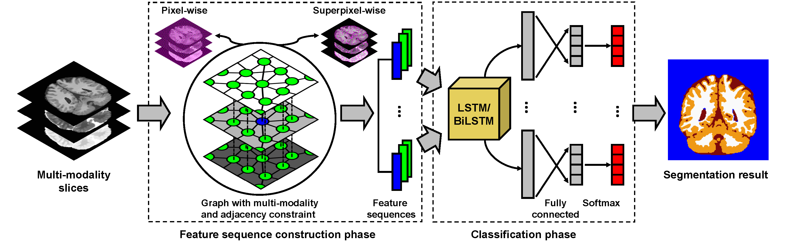
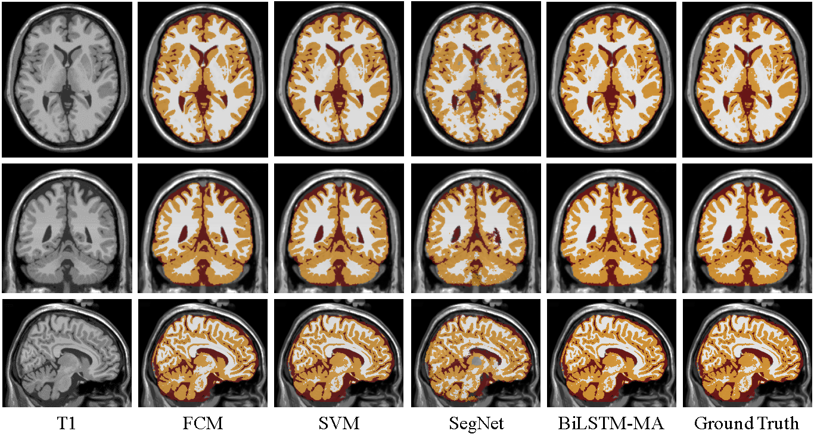
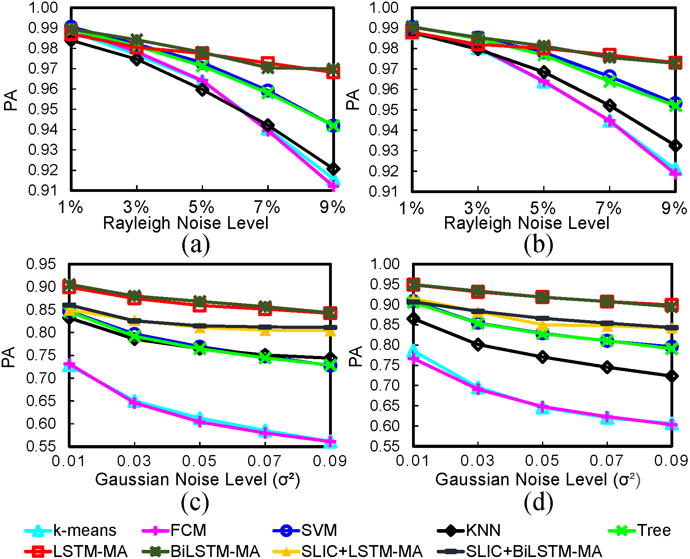

# MR-Brain-Tissue-Segmentation

MR brain tissue segmentation is a significant problem in biomedical image processing. The goal is to segment images into three tissues, namely white matter (WM), gray matter (GM), and cerebrospinal fluid (CSF). We use a LSTM method with multi-modality and adjacency constraint for brain image segmentation. We generate feature sequences from brain images and feed them into a trained LSTM/BiLSTM model to obtain semantic labels. This method achieves promising segmentation results as well as robustness to noise. 

## Paper
Kai Xie, Ying Wen. LSTM-MA: A LSTM Method with Multi-modality and Adjacency Constraint for Brain Image Segmentation. (Submitted to ICIP 2019)

## Code
Matlab code for implemention of our method: LSTM-MA and BiLSTM-MA. 

## Dataset
- [BrainWeb](http://brainweb.bic.mni.mcgill.ca/brainweb/): contains simulated MRI volumes for normal brain with three
modalities: T1, T2 and PD.
- [MRBrainS](http://mrbrains13.isi.uu.nl/): contains T1, T1 inversion recovery and FLAIR sequences.

## Pipline

Illustration of our proposed segmentation pipeline. Given the input of multi-modality slices, two phases are followed to obtain the final segmentation result. First is the sequence construction phase, feature sequences are generated in two ways, namely pixel-wise constraint and superpixel-wise constraint. Second is the classification phase, feature sequences are fed into a LSTM or BiLSTM layer separately followed by fully connected and softmax layer.

## Normal Brains

Segmentation results for WM (white), GM (yellow), and CSF (red) in three orthogonal views on BrainWeb. We choose FCM, SVM, SegNet and BiLSTM-MA (ours) for comparison.

## Images with Noise

we test LSTM-MA and BiLSTM-MA with pixel-wise and superpixel-wise constraint on different levels of noise in comparison with other five segmentation methods, i.e., k-means, FCM, SVM, KNN, Decision Tree. BrainWeb provides image noise with Rayleigh noise. MRBrainS provides image noise with Gaussian noise.
